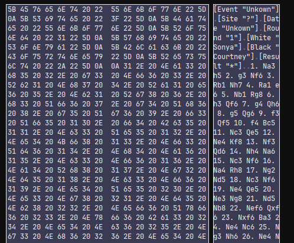
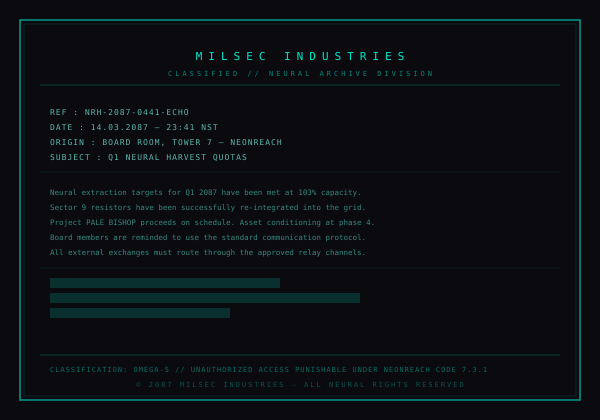
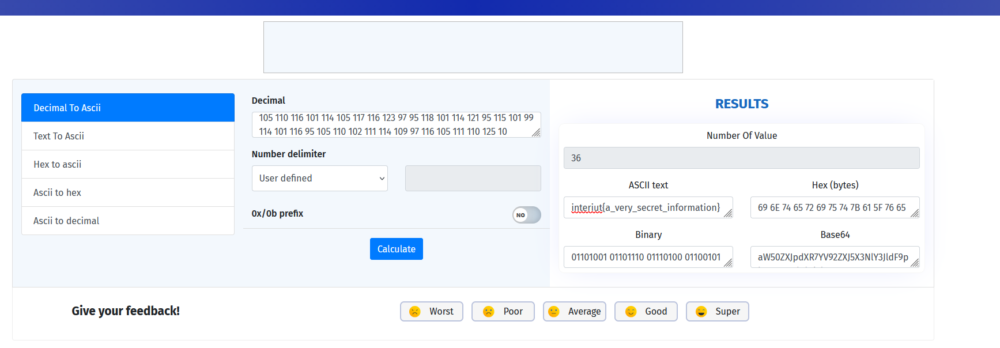

# Pale Bishop - Misc

## Description du défi

Null-Syndicate a réussi à intercepter des enregistrements de parties d'échecs. Bien que ces parties semblent anodines à première vue, l'organisation est convaincue que des documents secrets ont été transmis lors de ces rencontres. L'objectif est de retrouver le ou les documents échangés.

Note : Le titre **Pale Bishop** (Fou pâle) suggère un lien direct avec le jeu d'échecs, et, c'est fou, mais l'analyse va porter sur un fichier .pgn qui correspond à des parties exportées sous Lychess. Qui l'eût cru ?

---

## Analyse initiale

### Confirmation du format

Vu que je suis un énorme connard, et que j'ai pris l'habitude de hexview les fichier au lieu de `strings` ou d'ouvrir via .txt, donc en 5 secondes j'ai pu reconnaître les formats de notation des games de chess; merci vidéo random de 45mn que j'ai regardé à 3 heure du matin.



---

## Extraction des données cachées

### Utilisation de l'outil Chess_Steganography

L'outil [Chess_Steganography](https://github.com/KKlockenbrink/Chess_Steganography/blob/master/chessDecoder.py) a été utilisé pour décoder les mouvements. Après adaptation et exécution du script, un fichier SVG a été généré. Ce fichier contient une représentation graphique avec des éléments cachés.

Pour information; l'adaption en question était le travail titanesque de copier/coller le code, et de modifier le fichier d'import (sans oublier le **r** devant la string sinon Python explose avec les paths Windows)

### Contenu du SVG

Le fichier SVG généré contient un document structuré sous forme de rapport classifié, ainsi qu'une section cachée (`<g id="archive" aria-hidden="true">`) avec une série de cercles. Chaque cercle possède un attribut `r` (rayon) dont la valeur semble aléatoire.

```xml
<svg xmlns="http://www.w3.org/2000/svg" viewBox="0 0 600 420" width="600" height="420" font-family="monospace">
    <rect width="600" height="420" fill="#0a0a0f"/>
    <rect x="20" y="20" width="560" height="380" fill="none" stroke="#00ffe0" stroke-width="1.5" opacity="0.6"/>
    ...
    <g id="archive" aria-hidden="true">
        <circle cx="1" cy="-500" r="105" fill="none" stroke="none"/>
        <circle cx="2" cy="-500" r="110" fill="none" stroke="none"/>
        ...
        <circle cx="36" cy="-500" r="10" fill="none" stroke="none"/>
    </g>
</svg>
```



---

## Décodage des données

### Hypothèse ASCII

En lisant en diagonale, la section "hidden" m'a de suite intéressé. Surtout que, la valeur du rayon du cercle semble varier assez aléatoirement, je me suis donc dit que ça devait sûrement être un encodage, le premier me venant à l'esprit étant l'ASCII.

Voici les valeurs des rayons pour chaque cercle :

- 105, 110, 116, 101, 114, 105, 117, 116, 123, 97, 95, 118, 101, 114, 121, 95, 115, 101, 99, 114, 101, 116, 95, 105, 110, 102, 111, 114, 109, 97, 116, 105, 111, 110, 125

En convertissant ces valeurs en caractères ASCII, on obtient :

**Flag :** `interiut{a_very_secret_information}`



---

## Conclusion

J'ai trouvé ce défi terriblement intéressant. Bien que la solution soit *débile en soit* (je veux dire -- la plus grosse difficulté du challenge c'est trouver le bon outil), c'est la première fois que je vois ce genre de choses.

Donc franchement, je salue l'effort de faire quelque chose d'unique, et j'aurais découvert une nouvelle façon de cacher mes secrets .env sur un github pour la vanne.
