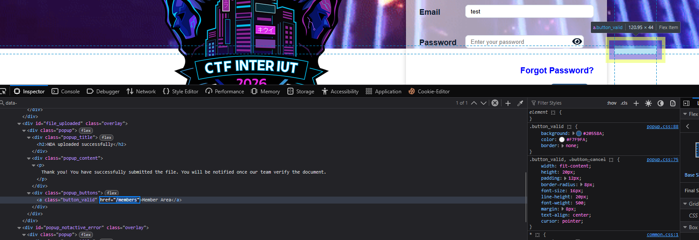
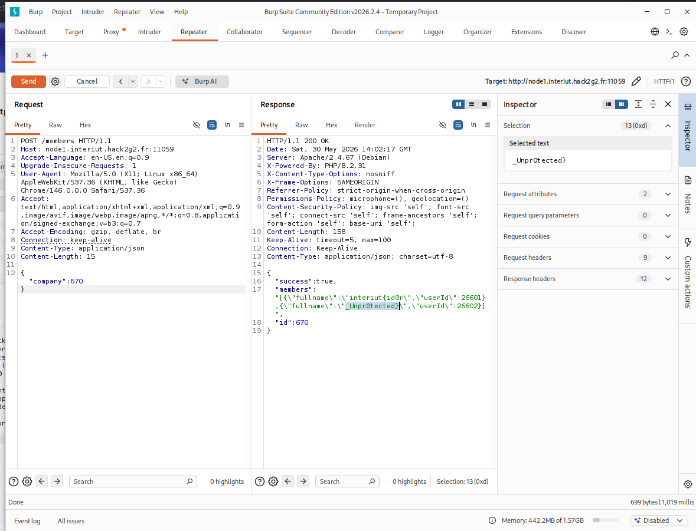

#  Company Enumeration  - web

## Description

Un portail interne de MilSec Industries permet aux employés de consulter les membres des entreprises partenaires avec lesquelles la corporation collabore.

Cependant, il est impossible de se connecter au portail.

En analysant le trafic, Null-Syndicate a découvert qu'une API interne est utilisée pour récupérer ces informations.

Le portail est bloqué, mais l’API ne l’est peut-être pas...

----

Ce WU suit exactement mon cheminement de réflexion, si une idée à l'air débile, ou que ça n'a strictement rien avoir avec la solution, c'est normal, c'est moi le connard ici.

Le premier élément que j'ai vu traîner était le token du login_form, dans le doute je me suis mis le token de côté. Au besoin, je me suis dit que je pourrais ajouter une header `Authorization: Bearer <id>`

```html 
<input type="hidden" id="login_form__token" name="login_form[_token]" value="03136567a260e173b5667ff3.d2MhBmkiAyfcA9Jh3qwcyUdFxRyRcHqoxY6zg0KrbIg.QVUTQlhnTxOFVKsgtPhVv34RhES8QwDN_Obewir7CsAGBmhUGloyQ5FpuQ">
``` 

Pour vérifier les endpoints/listings je suis passé par un bon vieux gobuster, sur une petite liste sinon le FW me renvoie à l'âge de pierre : 

```bash
┌──(venv)─(kali㉿kali)-[~/Flask]
└─$ gobuster dir -u "http://node2.interiut.hack2g2.fr:12792" -w /usr/share/wordlists/dirb/common.txt 
===============================================================
Gobuster v3.8.2
by OJ Reeves (@TheColonial) & Christian Mehlmauer (@firefart)
===============================================================
[+] Url:                     http://node2.interiut.hack2g2.fr:12792
[+] Method:                  GET
[+] Threads:                 10
[+] Wordlist:                /usr/share/wordlists/dirb/common.txt
[+] Negative Status codes:   404
[+] User Agent:              gobuster/3.8.2
[+] Timeout:                 10s
===============================================================
Starting gobuster in directory enumeration mode
===============================================================
.htaccess            (Status: 403) [Size: 333]
.htpasswd            (Status: 403) [Size: 333]
.hta                 (Status: 403) [Size: 333]
assets               (Status: 301) [Size: 388] [--> http://node2.interiut.hack2g2.fr:12792/assets/]
auth                 (Status: 200) [Size: 6517]
index.php            (Status: 301) [Size: 381] [--> http://node2.interiut.hack2g2.fr:12792/]
server-status        (Status: 403) [Size: 333]
Progress: 4613 / 4613 (100.00%)
===============================================================
Finished
===============================================================
```

Code retrouvé dans le auth : 


En partant de là on peut voit qu'on a une API à tester sous /members 
A priori, le nom du challenge étant "Enumeration", il est possible qu'on est juste à tester comme des débiles tout les membres possibles.

En testant juste à vide on obtient, via un `GET` : 
```json
{
    "success": false,
    "msg": "Not Authorized"
}
``` 

J'ai testé les schémas suivants : 
- /members/id_ici
- /members/list
- /members/id/id_ici 
- /members/cestquoicetteapiencoresuccessful/id_ici
- /members/envidecanner


Et c'est là qu'intervient un instant très important : réflechir deux secondes.
Parce que vous voyez, mon QI de caillou avait légèrement oublié qu'une API on la cherche en `POST` pas en `GET`. C'est pas grave, ça ne m'a pris que 5mn a capter, mais on dira rien.

A ce stade, il suffisait de tester les requêtes via BurpSuite Intruder et..attendre devant l'écran le temps de voir si le flag pop.

Donc bon, la faille principale ici est une IDOR, cette faille classique sur une API (**coucou l'ANTS**) permet d'accéder à des objets sans authentification. Voilà les enfants, n'oubliez pas de limiter les accès aux API via auth.

On retrouve le flag en clair au bout d'un moment.



## Flag : interiut{id0r_Unpr0tected}