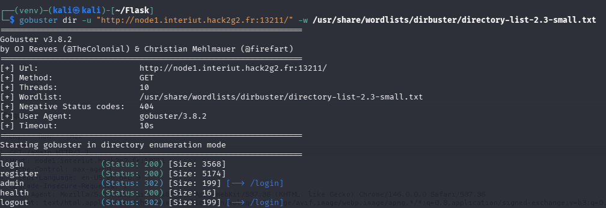
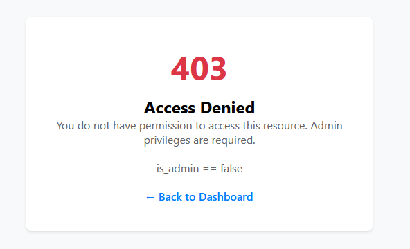
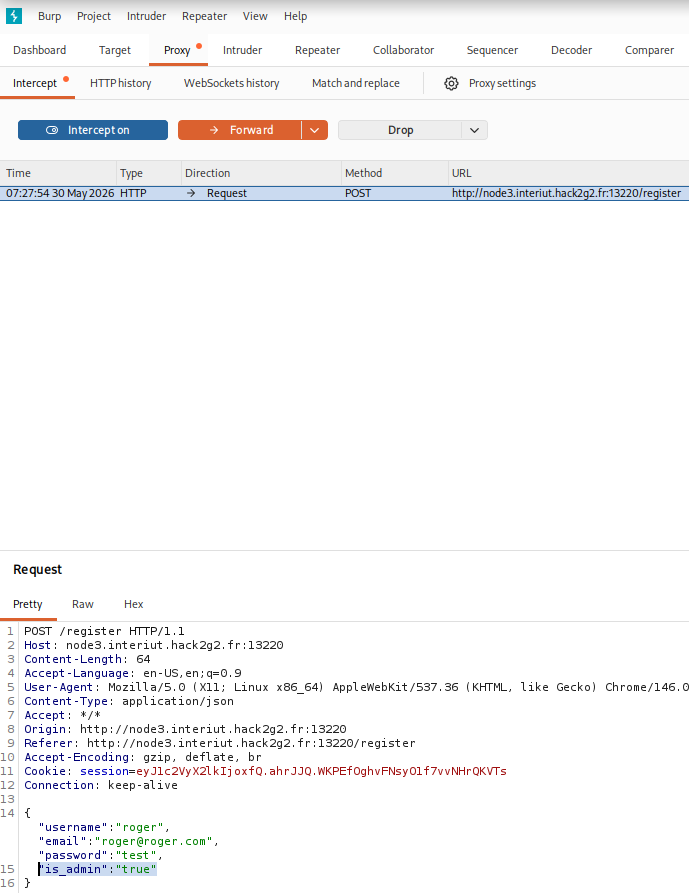
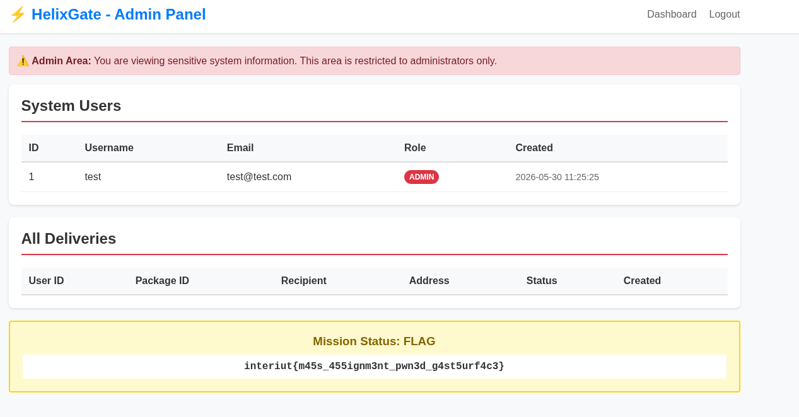

#  Never Fade Away  - web

## Description

Pour prouver votre valeur au sein de GhostSurface la branche de web hackers d'élite de Null-Syndicate, vous devez infiltrer l’un des services publics de HelixGate Systems. Ce portail est utilisé par des entreprises partenaires pour gérer leurs commandes de composants. Un membre de Null-Syndicate a découvert que l’application aurait un défaut de conception important. Si vous réussissez, GhostSurface pourra installer une backdoor chez HelixGate, ce serait la première brèche dans le réseau de MilSec...

----

L'interface est un formulaire de connexion soit très classique soit vibe codé, je sais pas mais j'ai un gros bouton connexion donc j'ai testé quelques SQLs qui n'ont menées à rien.

J'ai donc crée un compte d'une sécurité exceptionnelle, soit : 
- ID de compte : test
- E-Mail : test@test.test
- Mot de passe : **test**

En regardant le JWT j'ai vu un `{'user_id':'1'}`

Exemple de "JWT" : eyJ1c2VyX2lkIjoxfQ.ahqdKg.2qC8Dph2zLiwoKH06NMv2-yVK5c

Alors je ne sais pas comment c'est foutu, mais en essayant de décoder je tombe sur des choses assez absurdes ?
Voir : 
eyJ1c2VyX2lkIjoxfQ.ahqfWw.P36fO5IcKq8tOXTeOdmZoXCjAmQ = 
{"user_id":1}\u0006\u00A1\u00A9\u00F5\u00B0?~\u009F;\u0092\u001C*\u00AF-9t\u00DE9\u00D9\u0099\u00A1p\u00A3\u0002d

Peut-être un truc .php avec un appel de nom d'emplacement de fichier ? Et un chaining de commande ? (?~\ .. ;)

Problème : chaîne difficilement lisible en ASCII de base

Testons avec un autre pour voir les différences ? 
eyJ1c2VyX2lkIjoxfQ.ahqjIg.0PfNluZHz9ZFMZHBqUc6egQ1j6g + 
{"user_id":1}\u0006\u00A1\u00AA2 \u00D0\u00F7\u00CD\u0096\u00E6G\u00CF\u00D6E1\u0091\u00C1\u00A9G:z\u00045\u008F\u00A8

Donc a priori mauvaise piste ? *Mais c'est quoi cette merde?*

Bon, ça n'a pas l'air d'un JWT classique. Qui sait, c'est peut-être un format que je ne connais, mais même https://jwt.io est complètement du-per, donc à priori c'est quelque chose de propriétaire et pas une piste à vraiment vérifier.


J'ai lancé une tentative de bruteforce en arrière-plan pour tester, sans trop d'espoir. Et bon, ça n'a effectivement pas fonctionné.
```bash
┌──(venv)─(kali㉿kali)-[~/Flask]
└─$ python flask_unsign --unsign --cookie "eyJ1c2VyX2lkIjoxfQ.ahqo8g.KGyA4CSDPbpb8it2KcDeZYoVL7g" -w /usr/share/wordlists/rockyou.txt --no-literal-eval
[*] Session decodes to: {'user_id': 1}
[*] Starting brute-forcer with 8 threads..
[!] Failed to find secret key after 14344392 attempts.nd
```

Un scan rapide révèle un endpoint /admin 

On y retrouve quelque chose qui check pour is_admin= true, j'ai testé plusieurs headers et cookies au départ : `is_admin`, `admin`, `ADMIN`, `IS_ADMIN`



Tests partis de la commande : 

```bash
curl -v -b "session=eyJ1c2VyX2lkIjoxfQ.ahrAXQ.cxWNnRwd3L8dnHVwG9k8B9rSfJ8;is_admin=true;admin=true" -H "is_admin: true; admin: true" -X GET "http://node3.interiut.hack2g2.fr:13660/admin"
```

Type de vuln (indice) : Mass Assigment 
Voir : https://en.wikipedia.org/wiki/Mass_assignment_vulnerability


TROUVE : 
En fait en prenant en compte l'indice du Mass Assigment et en lisant la doc, je suis allé chercher le seul emplacement ou de la donnée utilisateur était set, qui correspondait au /register.

On peut voir dans burpsuite les champs, et il suffit qu'on ajoute notre champ



Résultat : 


## Flag : interiut{m45s_455ignm3nt_pwn3d_g4st5urf4c3}


### Ressources utiles : 
https://github.com/swisskyrepo/PayloadsAllTheThings/tree/master/Mass%20Assignment