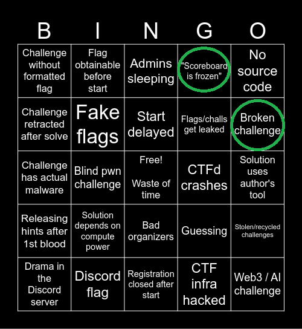

# 🏆 **InterIUT 2026 - On a (un peu) dominé**

For english speakers, `writeup-en.md` are made just for you :D.

Si vous ne savez pas ce que c'est ici, apprenez à lire le readme principal du repo. C'est toujours utile.

---

## **Retour d’expérience**
- **Le CTF ?** Fun. Assez complexe pour donner un challenge. Intéressant.
- **En équipe ?** **1ère place** 🥇 → *Bon c'était p'tet à 200pts de différence mais tkt.*
- **En solo ?** **20/59** 🎖️ → *Preuve que je sais faire des trucs… mais pas assez vite.*

---
**Bref.** On a gagné en équipe, j’ai tenu le coup en solo, et surtout… **on a appris des trucs**.
*(Et oui, j’ai quand même galéré sur des trucs débiles. Mais chut.)* 🍻

## Le traditionnel "Bad CTF Bingo"

Que deux cases, le scoreboard et la machine full-pwn qui a implosé parce que les PID sont parti faire la Macarena sous LSD.

PS : j'men fous du scoreboard mais pour la vanne c'est plus drôle
